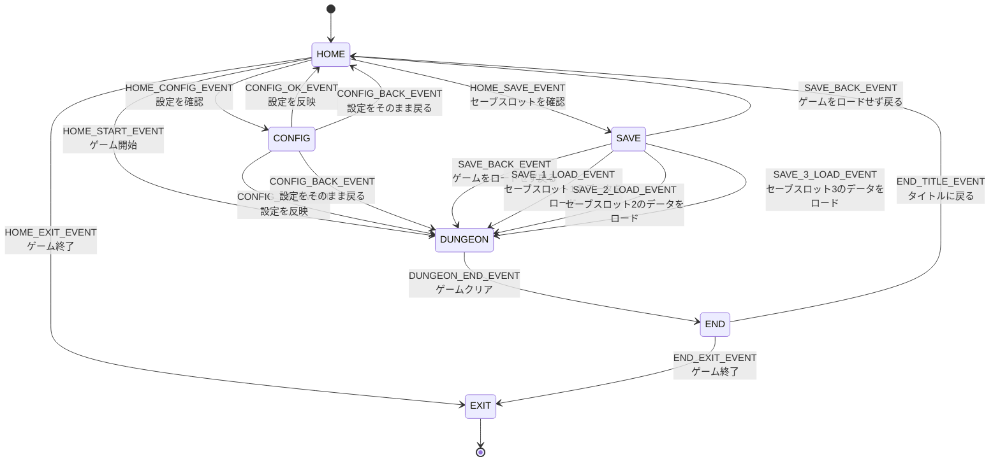

# ステータス遷移図

```mermaid
stateDiagram-v2
    [*] --> HOME
    
    HOME --> DUNGEON: HOME_START_EVENT<br/>ゲーム開始
    HOME --> SAVE: HOME_SAVE_EVENT<br/>セーブスロットを確認
    HOME --> CONFIG: HOME_CONFIG_EVENT<br/>設定を確認
    HOME --> EXIT: HOME_EXIT_EVENT<br/>ゲーム終了
    
    CONFIG --> HOME: CONFIG_OK_EVENT<br/>設定を反映
    CONFIG --> DUNGEON: CONFIG_OK_EVENT<br/>設定を反映
    CONFIG --> HOME: CONFIG_BACK_EVENT<br/>設定をそのまま戻る
    CONFIG --> DUNGEON: CONFIG_BACK_EVENT<br/>設定をそのまま戻る
    
    SAVE --> HOME: SAVE_BACK_EVENT<br/>ゲームをロードせず戻る
    SAVE --> DUNGEON: SAVE_BACK_EVENT<br/>ゲームをロードせず戻る
    SAVE --> DUNGEON: SAVE_1_LOAD_EVENT<br/>セーブスロット1のデータをロード
    SAVE --> DUNGEON: SAVE_2_LOAD_EVENT<br/>セーブスロット2のデータをロード
    SAVE --> DUNGEON: SAVE_3_LOAD_EVENT<br/>セーブスロット3のデータをロード
    
    DUNGEON --> END: DUNGEON_END_EVENT<br/>ゲームクリア
    
    END --> HOME: END_TITLE_EVENT<br/>タイトルに戻る
    END --> EXIT: END_EXIT_EVENT<br/>ゲーム終了
    
    EXIT --> [*]
```
