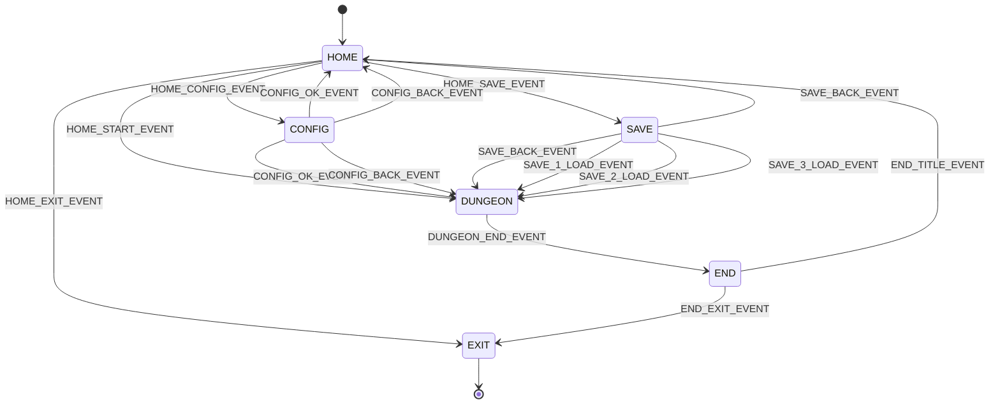

# ステータス遷移図
- ステータス遷移図は、ゲーム内の異なる状態（ステータス）と、それらの状態間の遷移を視覚的に表現する図です。
- これにより、ゲームのフローやプレイヤーの行動パターンを理解しやすくなります。

```mermaid
stateDiagram-v2
    [*] --> HOME
    
    HOME --> DUNGEON: HOME_START_EVENT
    HOME --> SAVE: HOME_SAVE_EVENT
    HOME --> CONFIG: HOME_CONFIG_EVENT
    HOME --> EXIT: HOME_EXIT_EVENT
    
    CONFIG --> HOME: CONFIG_OK_EVENT
    CONFIG --> DUNGEON: CONFIG_OK_EVENT
    CONFIG --> HOME: CONFIG_BACK_EVENT
    CONFIG --> DUNGEON: CONFIG_BACK_EVENT
    
    SAVE --> HOME: SAVE_BACK_EVENT
    SAVE --> DUNGEON: SAVE_BACK_EVENT
    SAVE --> DUNGEON: SAVE_1_LOAD_EVENT
    SAVE --> DUNGEON: SAVE_2_LOAD_EVENT
    SAVE --> DUNGEON: SAVE_3_LOAD_EVENT
    
    DUNGEON --> END: DUNGEON_END_EVENT
    
    END --> HOME: END_TITLE_EVENT
    END --> EXIT: END_EXIT_EVENT
    
    EXIT --> [*]
```
