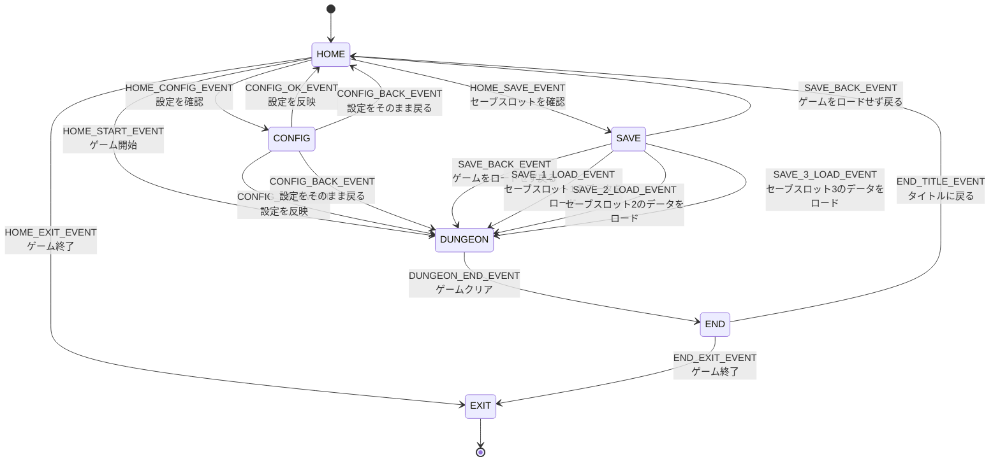

# ステータス遷移図

## ステータス説明

| ステータスID | 画面名      | 説明               |
|:--------|:---------|:-----------------|
| HOME    | ホーム画面    | TOP画面            |
| SAVE    | セーブ画面    | セーブ、ロード管理画面      |
| CONFIG  | 設定画面     | キーコンフィグや音量設定する画面 |
| DUNGEON | ダンジョン画面  | 実際のゲーム画面         |
| END     | エンディング画面 | ゲームクリア後の画面       |
| EXIT    | 終了状態     | アプリケーション終了       |

## 遷移パターン

### ホーム画面 (HOME)
アプリケーションの起点となる画面。以下の4つの主要機能へ遷移可能：
- **ゲーム開始**: 新規ゲームまたは続きからプレイ
- **セーブ/ロード**: セーブデータの管理・ロード
- **設定**: 操作方法や音量の調整
- **終了**: アプリケーションの終了

### 設定画面 (CONFIG)
ホーム画面またはダンジョン画面から呼び出し可能なモーダル画面。設定の反映またはキャンセル後、呼び出し元のステータスに戻る。

### セーブ画面 (SAVE)
ホーム画面またはダンジョン画面から呼び出し可能。データのロード実行時はダンジョン画面へ遷移し、キャンセル時は呼び出し元に戻る。

### ダンジョン画面 (DUNGEON)
実際のゲームプレイを行う画面。プレイ中はCONFIGやSAVE画面へのアクセスが可能（未定義の場合は実装時に検討）。ゲームクリア条件を満たすとエンディング画面へ自動遷移。

### エンディング画面 (END)
ゲームクリア後に表示される画面。プレイヤーはタイトル画面に戻るか、ゲームを終了するかを選択可能。

### 終了状態 (EXIT)
アプリケーションの終了を表す終端ステータス。

